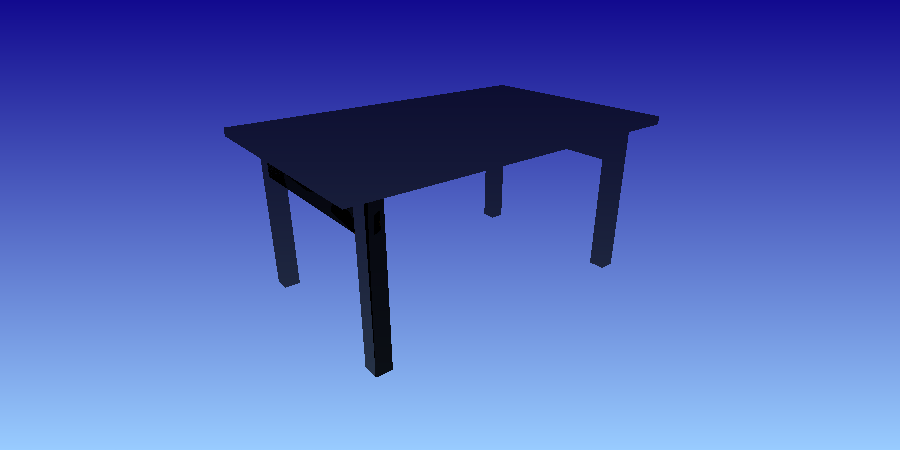
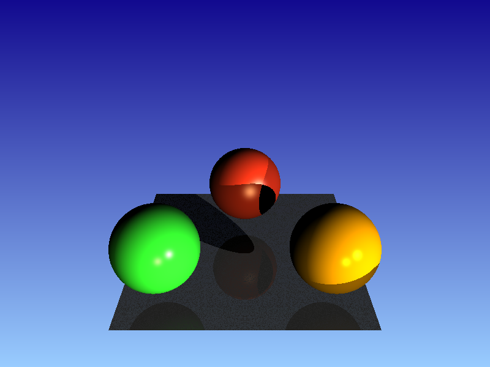
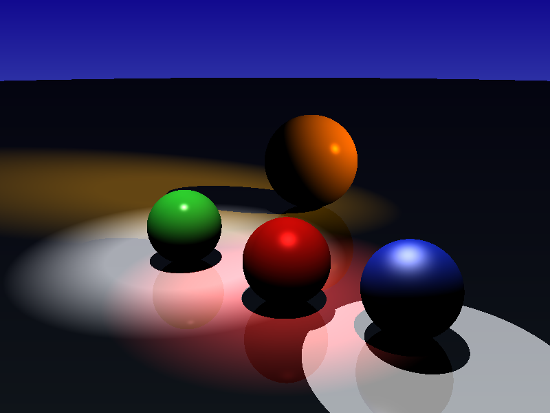

### COMPUTER GRAPHICS - Ray Tracer Project

##### [Abraão Vitor Lopes Dantas and Henrique David de Medeiros](#author)

This is a project to Computer Graphics I class (DIM0451-UFRN).

## Compile

Enter the folder of the projec and type:

`cmake .`

`make`

## Execute

`./main <input_file_name>.xml`

#### Teapot
  

### Table
  

### Three spheres over a plane
  

### Spot ilumination
  

## Author
Abraão Vitor Lopes Dantas  
IT and Computer Science Student.
Email: _abraaovld@gmail.com_

Henrique David de Medeiros  
IT and Computer Science Student.
Email: _henriquemed101@gmail.com_
