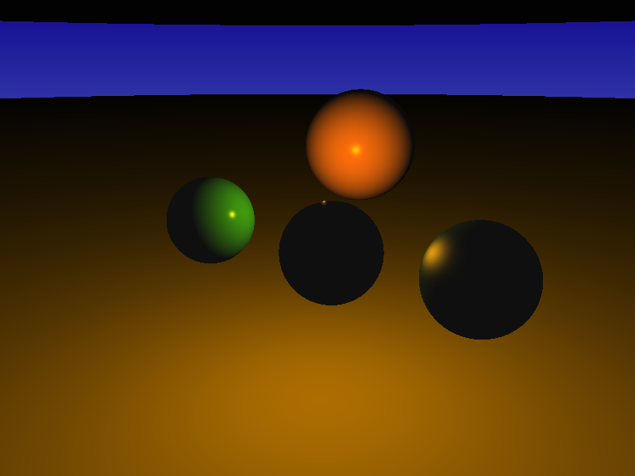
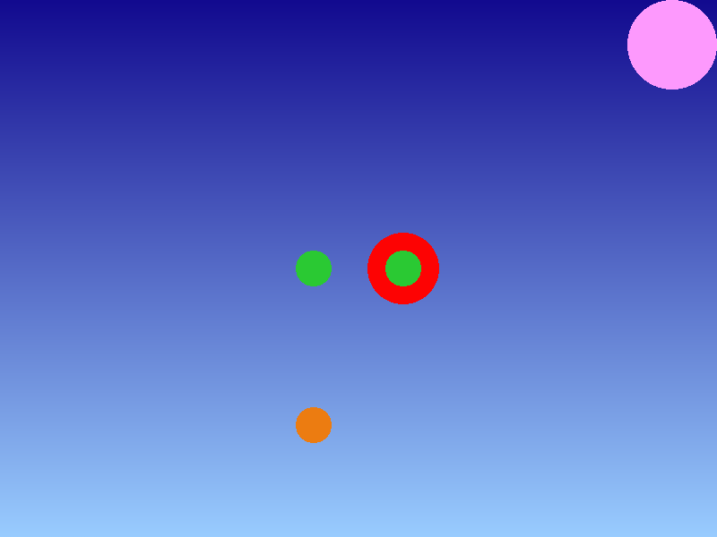
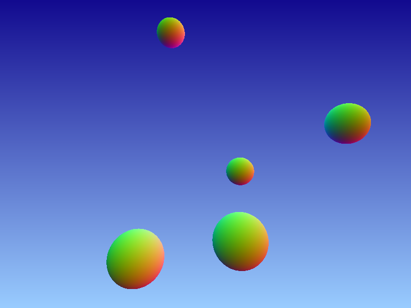
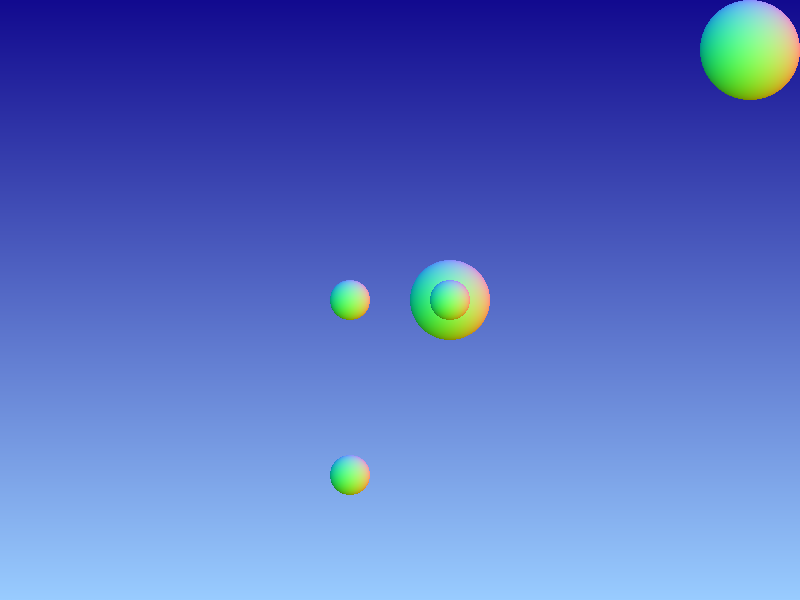

### COMPUTER GRAPHICS - Ray Tracer Project

##### [Abraão Vitor Lopes Dantas and Henrique David de Medeiros](#author)

# Project 4 - Integrators and Materials

This is a project to Computer Graphics I class (DIM0451-UFRN).

In this project, it was necessary to:

1. Rearrange the project structure and implement classes and methods suggested by the professor; (Abraão and Henrique)
2. Implement a `Material` class and and a derived `FlatMaterial` class that allows to specify a RGB color that will affect any object that comes afterwards the material tag; (Henrique)
3. Implement a `Integrator` class and the derived `FlatIntegrator` class, which implements the color assignment algorithm. (Abraão)

## Compile

Enter the folder of the projec and type:

`cmake .`

`make`

## Execute

`./main <input_file_name>.xml`

## Results

### Flat Integrator
#### Perspective
  
  
#### Orthografic
  
  
The normal integrator was implemented for extra credit

### Normal Integrator
#### Perspective 
  
  
#### Orthografic
  
  
  
## Author
Abraão Vitor Lopes Dantas  
IT and Computer Science Student. IT Technician(since 2016)  
Email: _abraaovld@gmail.com_

Henrique David de Medeiros  
IT and Computer Science Student. IT Technician (since 2016)  
Email: _henriquemed101@gmail.com_
