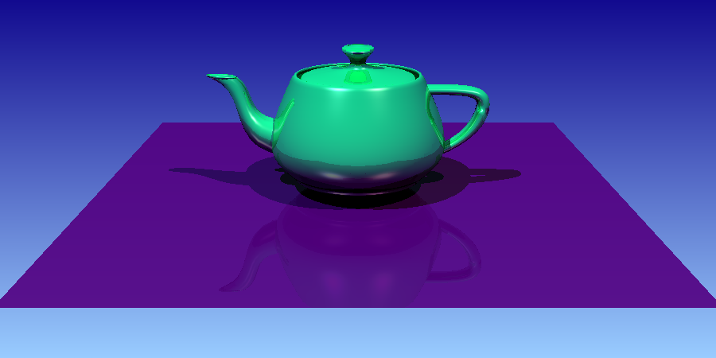

### COMPUTER GRAPHICS - Ray Tracer Project

##### [Abraão Vitor Lopes Dantas and Henrique David de Medeiros](#author)

# Project 7 - BVH

This is a project to Computer Graphics I class (DIM0451-UFRN).

In this project, it was necessary to:

1. Create bound box class e box's intersect method; (Abraão)
2. Implemented tree and tree's intersect; (Henrique)

## Compile

Enter the folder of the projec and type:

`cmake .`

`make`

## Execute

`./main <input_file_name>.xml`

## Results

### Triangle Mesh using BVH
#### Teapot
  
  
  
## Author
Abraão Vitor Lopes Dantas  
IT and Computer Science Student. IT Technician(since 2016)  
Email: _abraaovld@gmail.com_

Henrique David de Medeiros  
IT and Computer Science Student. IT Technician (since 2016)  
Email: _henriquemed101@gmail.com_
